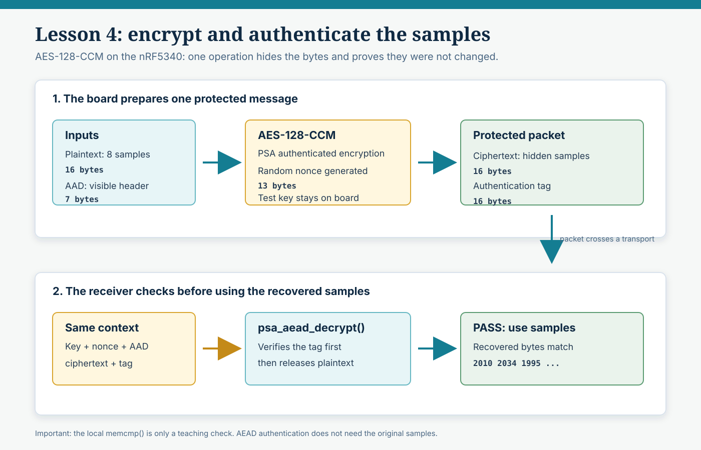

# Lesson 4 — Authenticated encryption with AES-128-CCM

[Notebook](../../README.md) · [Setup](../../docs/SETUP.md) · [Progress](../../docs/PROGRESS.md)

**TEST KEY — NOT FOR PRODUCTION.** The key is public in the source. This lesson teaches authentication but does not establish a secure production system. Anyone knowing this test key can decrypt or forge these demonstration messages.

## Visual explanation



Read the upper row from left to right: the board combines sample bytes and visible AAD with a generated nonce and test key. AES-128-CCM produces ciphertext plus an authentication tag. The lower row shows the receiver supplying that same context to `psa_aead_decrypt()`: the tag is checked before the recovered samples are accepted.

## 1. What are we trying to learn?

Encrypt eight simulated EMG samples, authenticate and decrypt them on the nRF5340, and confirm the recovered bytes match. The receiver's authentication check must work without knowing the original samples.

```text
Sample bytes + key + nonce + AAD
                ↓
      PSA authenticated encryption
                ↓
        Ciphertext + tag
                ↓
Key + same nonce + same AAD + ciphertext + tag
                ↓
      PSA authenticated decryption
                ↓
Success: use recovered samples
Failure: reject; do not use output
```

This entire round trip runs on the board. The Mac displays diagnostic text only. The deliberate corruption experiment belongs to Lesson 5 and is not implemented here.

## 2. Important concepts, in simple words

| Term | What it means here |
| --- | --- |
| Plaintext | The original 16 bytes representing eight ADC-like samples |
| Ciphertext | Those samples in encrypted form |
| AES key | A 16-byte value required to encrypt and to authenticate/decrypt |
| Nonce | A per-encryption value, not secret, which must not repeat with the same key |
| Authentication tag | A keyed check generated by AEAD; the receiver verifies it using the key |
| AAD | Additional authenticated data: readable metadata whose integrity is also protected |
| Encryption | Hides sample contents from someone without the key |
| Authentication | Checks that protected data is consistent with the key, nonce, AAD, and tag |
| Decryption | Recovers plaintext; with this AEAD API it also checks authentication |

AEAD means **Authenticated Encryption with Associated Data**. Here, the associated data is our small teaching header. It is not encrypted. Authentication is not a plain SHA-256 checksum that an attacker can recompute without a key.

### What changed since Lesson 3?

Lesson 3 used CTR and a local comparison against known original text. In this lesson, `psa_aead_decrypt()` validates the tag without receiving the original plaintext. A receiver can therefore verify a message it has never seen before. The later `memcmp()` remains only a local test of our example.

Unlike `psa_cipher_encrypt()` in Lesson 3, the single-call AEAD API does not generate or prepend the nonce. Our crypto helper explicitly generates it with PSA's RNG. The AEAD output is `ciphertext | tag`; the nonce and AAD remain separate buffers.

A valid tag does not prove freshness: replaying an old valid packet can still pass cryptographic verification. Sequence checking and replay policy are later work. A shared-key tag also does not identify which key holder sent the packet.

## 3. Why AES-CCM, and which backend?

We checked this installed SDK, not a newer release:

- NCS 2.4.0 has `nrf/samples/crypto/aes_ccm`, with `nrf5340dk_nrf5340_cpuapp` in its supported board list.
- The sample uses a 13-byte nonce and a 16-byte tag. We use those sizes with AES-128.
- `nrfxlib/nrf_security/src/drivers/nrf_cc3xx/Kconfig` defines CryptoCell CCM support. It also defines GCM support conditioned on CC312 availability; CCM is our supported teaching choice, not a claim that GCM is unavailable or worse.
- We explicitly request the CC3XX PSA driver in this lesson. Earlier lesson configurations are unchanged.

The generated configuration has `CONFIG_PSA_CRYPTO_DRIVER_ALG_CCM_CC3XX=y`; Oberon CCM is not selected. The compiled wrappers call `cc3xx_aead_encrypt()` and `cc3xx_aead_decrypt()`, linked from `libnrf_cc312_psa_crypto_0.9.17.a`. This establishes the selected hardware-backed implementation. Board runtime verification is pending; no power or timing measurements are claimed.

The general AEAD interface is documented in the [PSA specification](https://arm-software.github.io/psa-api/crypto/1.1/api/ops/aead.html). APIs, sizes, and Kconfig were also checked directly in the installed SDK headers, examples, and driver configuration.

## 4. Files, configuration, and code walkthrough

| File | Responsibility |
| --- | --- |
| [src/main.c](src/main.c) | Simulated samples, minimal byte encoding, printing, and round-trip check |
| [src/demo_crypto.h](src/demo_crypto.h) | Small byte-buffer interface and nonce/tag sizes |
| [src/demo_crypto.c](src/demo_crypto.c) | Import test key, generate nonce, call PSA AEAD, reject failed output |
| [prj.conf](prj.conf) | Console, PSA, memory, AES-CCM, and CryptoCell driver settings |
| [CMakeLists.txt](CMakeLists.txt) | Compile both C files into this independent application |

The crypto file knows nothing about EMG channels or serial transport. It receives byte buffers. This separation is useful when we later integrate Wings, although the fixed test key and demo nonce approach must be replaced.

New explicit options:

```ini
CONFIG_PSA_WANT_ALG_CCM=y
CONFIG_PSA_CRYPTO_DRIVER_CC3XX=y
```

The first requests CCM through PSA; the second enables the Nordic CryptoCell PSA driver and selects its platform support when appropriate. AES key support and per-algorithm driver settings are derived by Kconfig. The shared console, memory, timing, PSA, and RNG options have the same meaning as in the [setup table](../../docs/SETUP.md#every-configuration-choice-in-these-lessons).

### Our small example data

```c
uint16_t samples[] = {
    2010, 2034, 1995, 2051, 2070, 2028, 2001, 2040
};
```

The example header is 7 AAD bytes:

| Bytes | Meaning |
| --- | --- |
| `01` | Version 1 |
| `01` | Teaching value 1 for EMG_RAW |
| `01 00 00 00` | Sequence 1, 32-bit little endian |
| `08` | Eight samples |

The samples are encoded explicitly with `sys_put_le16()`, two bytes each, low byte first. We do not encrypt a C struct or depend on its padding. The original sample bytes are:

```text
da07f207cb0703081608ec07d107f807
```

This is the minimum illustrative data needed for AEAD, not a final Wings wire format or transport frame. Full packet design remains in later lessons.

### Encryption and authentication

The key is imported as AES-128 with permission for CCM encryption and decryption. The helper calls `psa_generate_random()` to obtain a nonce, then:

```c
psa_aead_encrypt(key, PSA_ALG_CCM, nonce, DEMO_NONCE_SIZE,
    aad, aad_length, plaintext, plaintext_length,
    output, output_size, output_length);
```

For this payload, the output has 16 ciphertext bytes plus the default 16-byte tag. The tag is printed separately for teaching, but decryption receives the combined 32-byte buffer.

### Verification and decryption

```c
psa_aead_decrypt(key, PSA_ALG_CCM, nonce, DEMO_NONCE_SIZE,
    aad, aad_length, input, input_length,
    output, output_size, output_length);
```

Notice there is no original-plaintext argument. On failure, our helper clears the output buffer, reports zero output length, and returns the error. The caller branches to cleanup and does not print or parse it. Only `PSA_SUCCESS` permits use of the recovered bytes.

After that success, `main.c` compares length and bytes against the original as an additional development check and prints the recovered samples. It releases the imported key on every path after successful import.

### Nonce and key limitations

The 13-byte nonce is generated randomly for this one-encryption-per-boot experiment. Random sampling does not guarantee uniqueness; this is not a production nonce allocation policy. We do not reset a fixed nonce to zero on boot. Lesson 6 will address nonce management properly. This nonce size permits CCM payloads up to 65535 bytes; our payload is only 16 bytes.

The fixed key is public and stored in firmware. Destroying the volatile PSA object does not remove that source key from the firmware image. Real key provisioning is future work.

## 5. Build, flash, and see the result

From the `cryptocell` root:

```sh
./lesson.sh build 4
./lesson.sh flash 4
./lesson.sh ports
./lesson.sh monitor /dev/cu.usbmodem0010500464391
```

Select your actual serial port and press RESET. In the Nordic UI, select `lessons/04_aead_ccm`, NCS 2.4.0, and `nrf5340dk_nrf5340_cpuapp` with its own build directory. Check for a verified successful flash; a build alone is not a hardware test.

## 6. Expected output

```text
Wings crypto - Phase 4: AES-128-CCM
TEST KEY - NOT FOR PRODUCTION
psa_crypto_init: 0
psa_import_key: 0
Header: version=1 type=EMG_RAW sequence=1 count=8
AAD (7 bytes): 01010100000008
Plaintext samples (16 bytes): da07f207cb0703081608ec07d107f807
AEAD encrypt (including nonce generation): 0
Nonce (13 bytes): <26 hex characters>
Ciphertext (16 bytes): <32 hex characters>
Authentication tag (16 bytes): <32 hex characters>
psa_aead_decrypt: 0
Authentication: PASS
Recovered bytes (16 bytes): da07f207cb0703081608ec07d107f807
Recovered samples: 2010 2034 1995 2051 2070 2028 2001 2040
Exact match: YES
psa_destroy_key: 0
Phase 4 complete
```

The angle-bracket fields are placeholders. The real nonce, ciphertext, and tag normally change between runs. The recovered bytes must match the original. Printing plaintext is for learning, not a confidential production transport.

## 7. Two small experiments

1. Press RESET again. The nonce, ciphertext, and tag should change; the samples should be the same and authentication should pass.
2. Change the first sample from `2010` to `2011`, save, build, and flash Lesson 4. The recovered first sample must now be `2011`, and authentication must still pass. Restore the original to match the baseline above.

Do not add the corruption experiment here yet; it is the separate Lesson 5 milestone.

## 8. Stop and record

Send the device output, especially `Authentication: PASS`, `Exact match: YES`, and the PSA status lines. No Lesson 5 code is included.

**Supervisor explanation:** “This example adds a keyed authentication tag to encrypted simulated EMG samples. The receiving operation verifies the data without knowing the original samples. The code builds with the CC312 driver; device output is needed to confirm the hardware demonstration. It is still a fixed-key, local round-trip experiment, without a PC receiver or production nonce/replay policy.”
